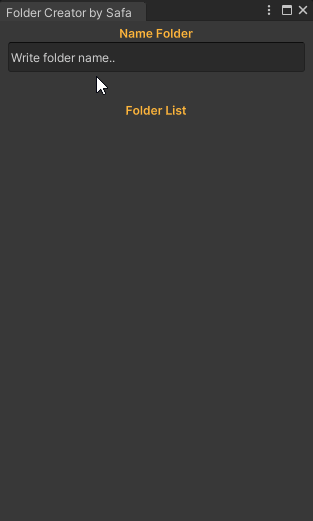

# 📁 Folder Creator by Safa

A lightweight and user-friendly Unity Editor tool that allows you to create project folders quickly and keep your project organized.

> ✨ Simple but powerful folder generation tool to speed up Unity project setup.

---

## 🔧 Features

-  Custom folder structure creation via editor window
-  Input field to name your folders
-  Displays a list of created folders
-  Designed with a clean and minimal UI
-  Saves time during project bootstrapping

---

## 🔗 Repository

You can find the full source code here:  
👉 [GitHub - FolderCreator by thekrocker](https://github.com/thekrocker/FolderCreator-EditorTool-for-Unity)

---

## 🛠️ How to Use

1. Clone or download the repository.
2. Place the `Editor` folder inside your Unity project.
3. Go to `Tools/Folder Creator`.
4. Enter a folder name and press **Enter** to create.

---

## 📂 Why Use It?

When starting a new Unity project, it’s common to create the same directory structure repeatedly (`Scripts`, `Prefabs`, `Materials`, etc.). This tool removes the manual effort and automates it with a single editor window.

---

## 🧠 Ideal For

- Game developers who want consistent project hierarchy.
- Teams who follow shared folder naming conventions.
- Rapid prototyping and Game Jam setups.

---

## 🖼️ Screenshot

---

## 📦 Tech Stack

`Unity • C# • EditorWindow • UI Toolkit`

---

Feel free to fork and expand upon it. Contributions are welcome!
