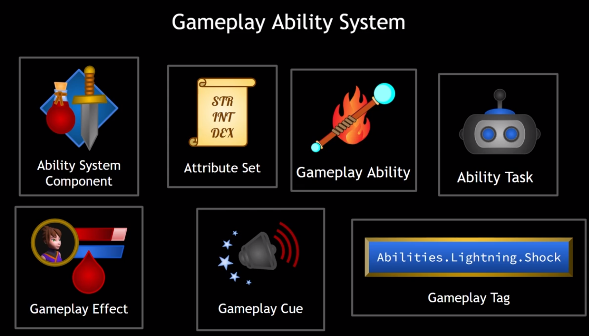

# Section 02 - Intro to the GAS

### GAS High Level Overview

GAS is a modular system that helps us to create spells, abilities, attributes & all the stuffs to create a complete ability system in a game. It has so many coverages and we will be seeing them in the tutorials.

---

### Main Parts of GAS



**Ability System Component**

 ****It handles granting abilities, activating abilities, notifications, effects etc. If we want a character participate in GAS, we should definitely add it to the character.

**Attribute Set**

We store our attributes in attribute sets. 

**Gameplay Ability**

An ability class to create ability and write its own logic. They run **ability task** which helps us to do in time async.

**Gameplay Effects**

They helps us to modify attribute values directly and indirectly. Change them over time etc.

**Gameplay Cues**

Effects that is visual, SFX etc. When we want to create particle, play sound etc. we should use gameplay cues.

**Gameplay Tags**

They exist in outside of GAS but they are extremely useful for identifying spells etc. We use them a lot since spells are used and affected. 

---

### Ability System Component


We have 2 choice to integrate ACS to our characters. One is adding directly to the pawn. And other choice is to add it to the PlayerState etc.

Second choice is better because when we want to destroy actor, it will also destroy the ACS component which will block us to go further. For enemies, we can directly put them directly in pawn.

**First Steps**

- Player State Class
- Ability System Component
- Attribute Set

---

**The Player State**

We are going to initialize ability system component inside the Player State for our player. So we need to create Player State c++ class derived from Player State, and we should assign it inside our Game Mode. We will be controlling our ACS from player state. But for enemies, its enough to put it inside PAWN directly meaning we can add it to the CharacterBase.h. So our pointers called UAbilitySystemComponent and UAttributeSet will be defined inside CharacterBase, so player will also have that pointers. We also defined them in PlayerState, so its duplicated. To handle this, we will cover why we initialized in both side inside “**Init Ability Actor Info**” topic.

---

**The Replication Mode**

AbilityComponent→SetReplicationMode()

Ability components have multiplayer features to set replication mode. There are best practises to follow so for player ACS, we should go as mixed. For AI controlled pawns etc. We should set it to minimal since they dont need to update effects etc.


---

**Initializing Ability Actor Info**


To initialize Ability Actor info, we need 2 parameters, Owner & Avatar. Owner means who own the ability and avatar is the representation of the ability. For enemy, they might be the same but for Player actor, Owner will be Player State and avatar will be Player character itself. 

*Where can we initialize ability actor info?*

For Player-Controlled Characters

- After pawn possesion (controller has been set for the pawn) (PossessedBy())
- After PlayerState replicated (OnRep_PlayerState),

```cpp
void APlayerCharacter::InitializeAbilityActorInfo()
{
	APlayerCharacterState* State = GetPlayerState<APlayerCharacterState>();
	check(State);
	AbilitySystemComponent = State->GetAbilitySystemComponent();
	AttributeSet = State->AttributeSet;
	State->GetAbilitySystemComponent()->InitAbilityActorInfo(State, this);
}
```

For AI-Controlled Characters

- BeginPlay() will be enough since we spawn AI and set it.

---

### Attributes

[https://docs.unrealengine.com/5.0/en-US/gameplay-attributes-and-attribute-sets-for-the-gameplay-ability-system-in-unreal-engine/](https://docs.unrealengine.com/5.0/en-US/gameplay-attributes-and-attribute-sets-for-the-gameplay-ability-system-in-unreal-engine/)

> **Keywords**: FGameplayAttributeData
> 

Attributes are structs that represents stats like strength, health, mana, crit strike etc. Attribute values are floats and they can be changed directly, but preferred way is to apply **gameplay effect.** And other reason is to use prediction system on multiplayer. Attributes will be inside Attribute Sets to manage them. They will have base value & current value to apply temporary changes.


*How to create attribute in an attribute set?*

- In our AttributeSet class, we need to override a method to replicate values & notify:

```cpp
virtual void GetLifetimeReplicatedProps(TArray<FLifetimeProperty>& OutLifetimeProps) const override;
```

- Now we can create our first attribute: Health, it should be a type of **FGameplayAttributeData**
- We should add UPROPERTY to the variable itself for several reasons: To add it to blueprint, to replicate the variable.
- ReplicatedUsing = “OnRep_VariableName” should be used inside UProperty, every attribute that is going to be replicated should have its own method to replicate. Methods should implement **UFUNCTION()**
    
    
    

> “With GAS, the creation of the Attribute Set and Attributes is the most boilerplate-heavy step in the whole system. Unfortunately, this is the way we must do it for now.”
> 
> 
> Stephen Ulibarri
> 
- So no worries if you feel likle boiler-plate coding. We also need some of macros to call in OnRep methods to notify gameplay ability system. [DOREPLIFETIME_CONDITION_NOTIFY](https://docs.unrealengine.com/4.27/en-US/InteractiveExperiences/Networking/Actors/Properties/Conditions/) and GAMEPLAYATTRIBUTE_REPNOTIFY.

```cpp

DOREPLIFETIME_CONDITION_NOTIFY(AttributeSet, Variable, CND_None, REPNotify_Always)

GAMEPLAYATTRIBUTE_REPNOTIFY(AttributeSet, OldValue)
```

- As we remember, inside GetLifetimeReplicatedProps(), we need to use DOREPLIFETIME macros to define replicate conditions etc.

*An Example*

```cpp
void USafaAttributeSet::GetLifetimeReplicatedProps(TArray<FLifetimeProperty>& OutLifetimeProps) const
{
	Super::GetLifetimeReplicatedProps(OutLifetimeProps);
	DOREPLIFETIME_CONDITION_NOTIFY(USafaAttributeSet, Health, COND_None, REPNOTIFY_Always);
	DOREPLIFETIME_CONDITION_NOTIFY(USafaAttributeSet, MaxHealth, COND_None, REPNOTIFY_Always);
	DOREPLIFETIME_CONDITION_NOTIFY(USafaAttributeSet, Mana, COND_None, REPNOTIFY_Always);
	DOREPLIFETIME_CONDITION_NOTIFY(USafaAttributeSet, MaxMana, COND_None, REPNOTIFY_Always);
}

void USafaAttributeSet::OnRep_Health(const FGameplayAttributeData& OldHealth) const
{
	GAMEPLAYATTRIBUTE_REPNOTIFY(USafaAttributeSet, Health, OldHealth);
}

void USafaAttributeSet::OnRep_MaxHealth(const FGameplayAttributeData& OldMaxHealth) const
{
	GAMEPLAYATTRIBUTE_REPNOTIFY(USafaAttributeSet, MaxHealth, OldMaxHealth);
}

void USafaAttributeSet::OnRep_Mana(const FGameplayAttributeData& OldMana) const
{
	GAMEPLAYATTRIBUTE_REPNOTIFY(USafaAttributeSet, Mana, OldMana);

}

void USafaAttributeSet::OnRep_MaxMana(const FGameplayAttributeData& OldMaxMana) const
{
	GAMEPLAYATTRIBUTE_REPNOTIFY(USafaAttributeSet, MaxMana, OldMaxMana);
}
```

**Attribute Accessors**

Accessors help us to change attribute values directly. To edit values we can define a macro above the attribute class to not write unnecessary boiler-plate code.

```cpp
#define ATTRIBUTE_ACCESSORS(ClassName, PropertyName) \
	GAMEPLAYATTRIBUTE_PROPERTY_GETTER(ClassName, PropertyName) \
	GAMEPLAYATTRIBUTE_VALUE_GETTER(PropertyName) \
	GAMEPLAYATTRIBUTE_VALUE_SETTER(PropertyName) \
	GAMEPLAYATTRIBUTE_VALUE_INITTER(PropertyName)
```

This is a MACRO that automatically generate all the boilerplate code for the property without you having to type out everything. Here is the comments for the MACRO as per unreal.

Then we can easily add the macro below the variable we have created.

```cpp
UPROPERTY(BlueprintReadOnly, ReplicatedUsing = OnRep_Health)
FGameplayAttributeData Health;
ATTRIBUTE_ACCESSORS(AttributeSet, Health)
```

In AttributeSet.cpp’s constructor, we can now call InitHealth(), SetHealth(), etc. easily. 

To debug, we can use this command in Unreal Engine to see values:

```cpp
showdebug abilitysystem
```

Now we will have a test actor to edit our attribute values directly, since we didnt learn gameplay effects, we will do it in inefficient way. 

Lets create an actor and bind to BeginOverlapEvents

```cpp
void AEffectActor::BeginPlay()
{
	Super::BeginPlay();

	SphereComponent->OnComponentBeginOverlap.AddDynamic(this, &AEffectActor::OnOverlapBegin);
	SphereComponent->OnComponentEndOverlap.AddDynamic(this, &AEffectActor::OnOverlapEnd);
	
}
```

Inside BeginOverlap Function, we will try to cast OtherActor as IAbilitySystemInterface and access to the attribute set. Since the given attibute set is const, we will const_cast which is very inefficient but for testing purposes, we will go that way. We are going to change that system once we are into **Gameplay Effects**.

```cpp
void AEffectActor::OnOverlapBegin(UPrimitiveComponent* OverlappedComponent, AActor* OtherActor,
	UPrimitiveComponent* OtherComp, int32 OtherBodyIndex, bool bFromSweep, const FHitResult& SweepResult)
{
	if (IAbilitySystemInterface * AbilitySystemInterface = Cast<IAbilitySystemInterface>(OtherActor))
	{
		const UAttributeSet* AttributeSet = AbilitySystemInterface->GetAbilitySystemComponent()->GetAttributeSet(UAttributeSet::StaticClass());
		const USafaAttributeSet* SafaAttributeSet = Cast<USafaAttributeSet>(AttributeSet);

		// Since it constant, we cant do that way. We will hack to this.
		// SafaAttributeSet->SetHealth(SafaAttributeSet->GetHealth() - 10.0f);

		// So we cast the const to non-const and then we can change the value. THIS IS HIGHLY BAD PRACTICE. WE WILL CHANGE THIS LATER.
		USafaAttributeSet* NonConstSafaAttributeSet = const_cast<USafaAttributeSet*>(SafaAttributeSet);
		NonConstSafaAttributeSet->SetMana(SafaAttributeSet->GetMana() + 10.0f);
		Destroy();
	}
}
```

So one last thing to do is create BP_EffectActor, for now we will create **BP_Potion**, and result will be mana increasing +10 when overlapped with the mana.