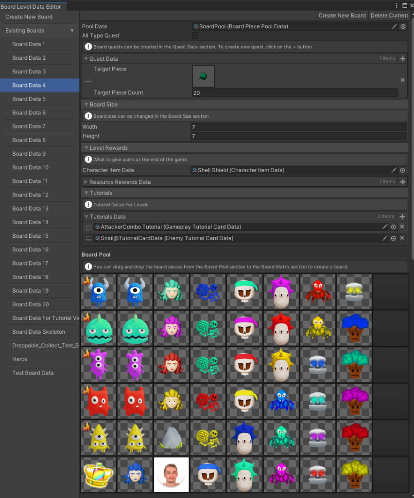
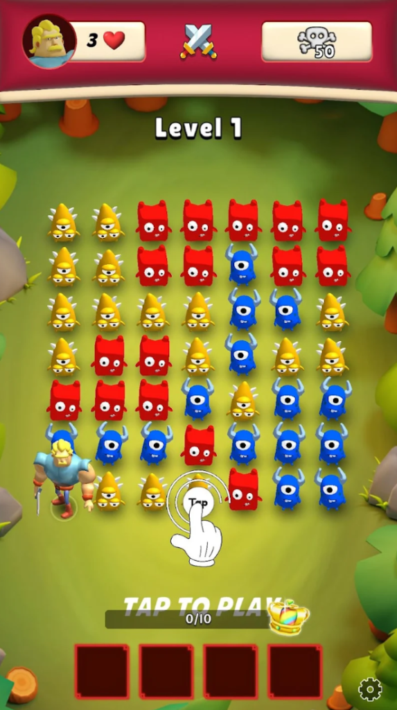
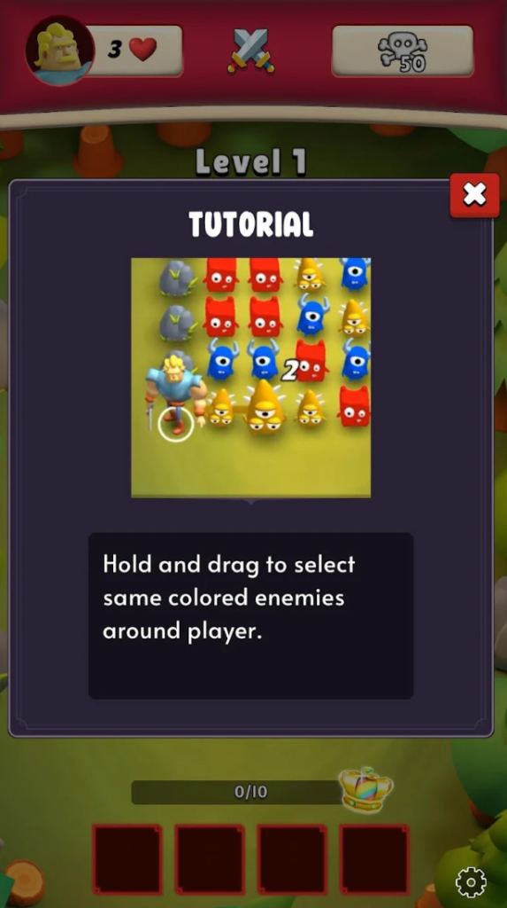

# Hero Crush

> A Grindstone-inspired puzzle game where players select adjacent enemies to unleash powerful combos, use skills, and conquer strategic levels.

---

## 🗂 Overview

- **Genre**: Puzzle / Combo / Action  
- **Platform**: Web (Playable Demo)  
- **Engine**: Unity  
- **Language**: C#  
- **Tools**: Custom Level Editor, Object Pooling, ScriptableObjects, Event System  

---

## 📸 Media

  
  
  

> [Watch the Gameplay Trailer](https://www.youtube.com/watch?v=d8ED-qzVyHE)

---

## 💻 What I Did

- Designed and developed a custom **Level Editor** to create, save, and test levels quickly  
- Built a **dynamic grid system** using 2D arrays that resizes and spaces tiles based on screen resolution  
- Implemented the **Line Renderer selection system** to allow players to drag across adjacent same-color enemies  
- Developed a flexible **Inventory System** that supports equipping, upgrading, and saving player items  
- Created **Boss and Modifier systems** using ScriptableObjects for modular enemy behavior  
- Implemented **Skill Upgrade system** with unlocks, leveling, and passive bonuses  
- Used **Object Pooling** and search/sort algorithms with performance (Big O) in mind  
- Applied **SOLID principles** and built the game with **event-driven architecture** for scalability  
- Created a **Save System** to persist player progress, inventory, and skill state  
- Developed an intuitive **Tutorial System** that guides players based on level and progress flags

---

## 🔧 Key Features

- ✅ Grid-based puzzle gameplay with real-time selection  
- ✅ Inventory system with equipping, upgrading, and skill management  
- ✅ Level Editor to speed up content production  
- ✅ Boss Modifiers and Skill Unlock system  
- ✅ Responsive board layout with adaptive tile spacing  
- ✅ Save/Load system for persistent progression  
- ✅ Optimized with pooling, grid caching, and clean architecture

---

## 🧪 Challenges & Solutions

> **Challenge**: Making the board dynamic for all screen sizes  
> **Solution**: Used responsive spacing and calculated tile dimensions to adapt the grid to any resolution.

> **Challenge**: Managing performance as the game scales with more effects and enemies  
> **Solution**: Used Object Pooling, optimized algorithms, and avoided redundant recalculations in the selection logic.

---

## 🔬 Technical Highlights

- **2D Grid System**: Resizes dynamically based on screen aspect ratio  
- **Level Editor**: Standalone Unity tool for rapid level creation and testing  
- **Line Renderer**: Used to visualize and validate player selections  
- **Modifiers**: Built using ScriptableObjects for bosses and special enemy traits  
- **Event System**: Event-driven UI and gameplay updates decoupled via interfaces  
- **Inventory**: Supports item slots, equipment logic, and upgrade flow  
- **Optimization**: Object pooling and grid caching used extensively to maintain performance  

---

## 🧠 Lessons Learned

- Designing a level editor early can dramatically increase iteration speed and design freedom  
- Event-driven systems simplify communication between UI, gameplay, and effects  
- Thinking in terms of performance (O(n), pooling, reuse) from the start avoids major refactors later  
- SOLID principles lead to cleaner, more maintainable systems — especially in inventory and ability logic  
- Even small games benefit greatly from structure, tooling, and modular data systems

---

## 📦 Tech Stack

`Unity • C# • Line Renderer • Object Pooling • ScriptableObjects • Event System • Custom Level Editor • Save System`
