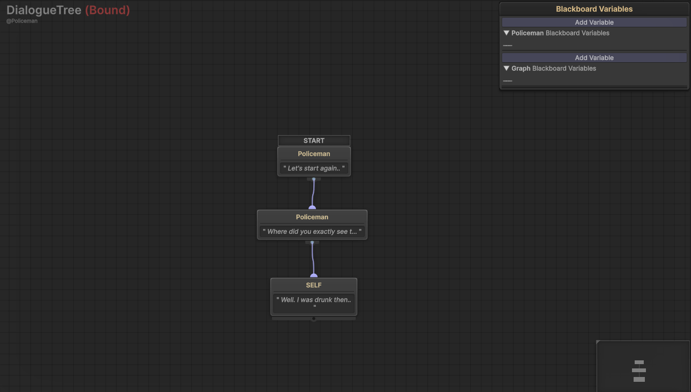
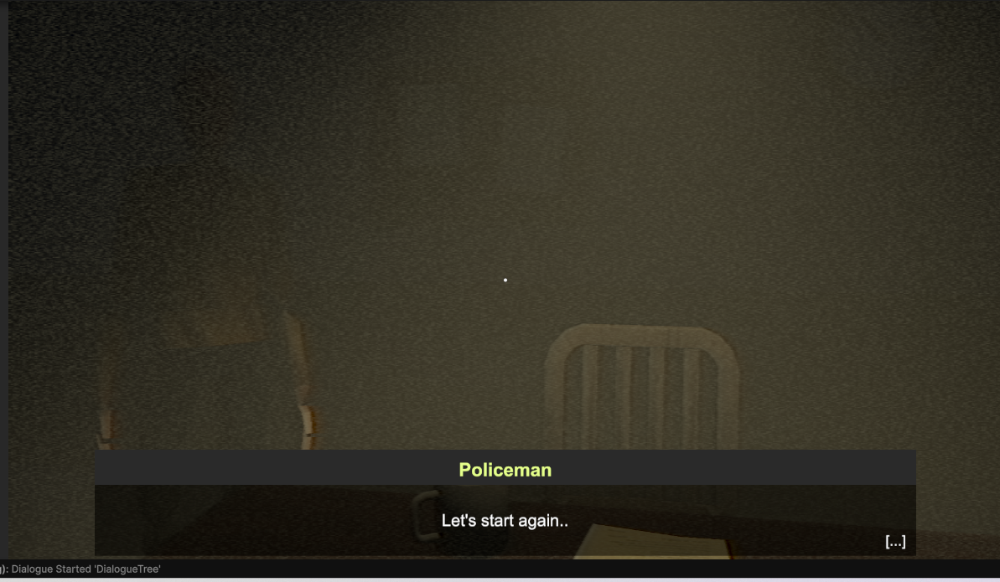
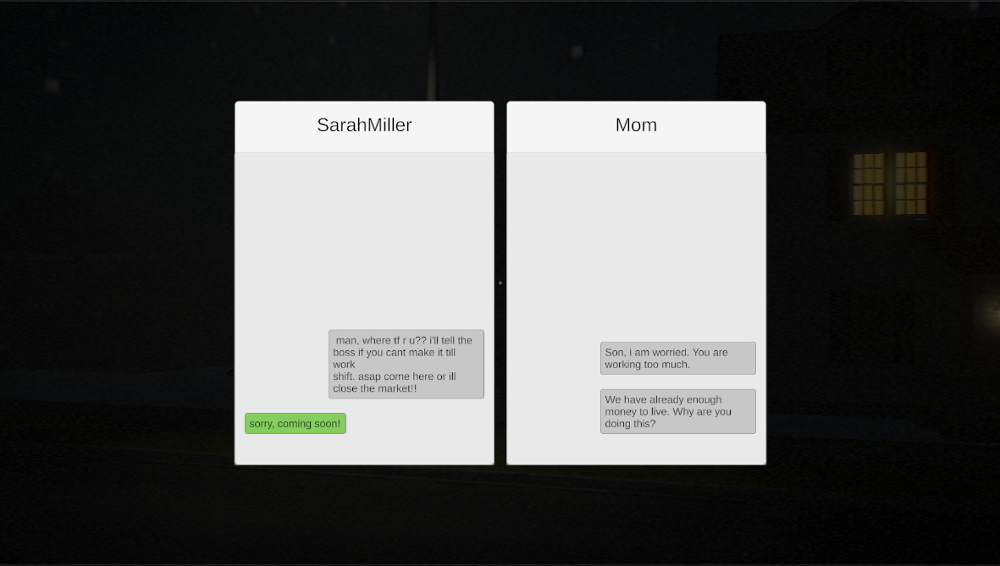
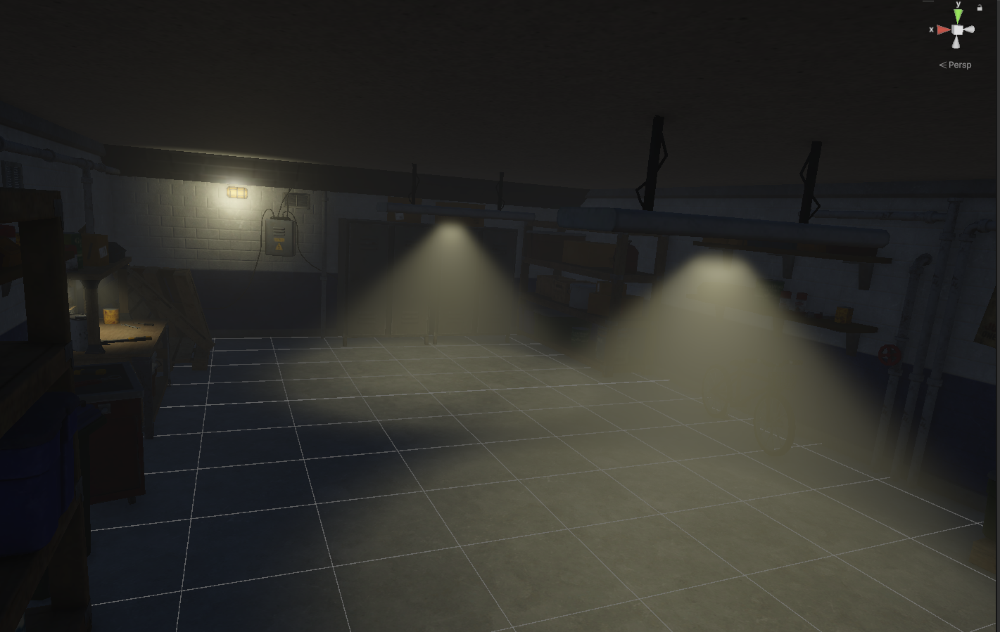

# Horror X – Supermarket Horror Simulator

> A first-person horror sim where you manage a late-night supermarket while uncovering a sinister mystery. Inspired by Puppet Combo-style VHS horror.

---

## Overview

- **Genre**: Psychological Horror / Simulation
- **Platform**: PC
- **Engine**: Unity 2022.3
- **Language**: C#

---

## Media

  
  
  
  

---

## Concept

You're working the night shift at a local supermarket. It seems normal at first — restocking shelves, serving customers — until strange things start happening. Missing coworkers. Lights flicker. Something's watching.

This game blends task-based gameplay with scripted horror events, telling a chilling story of a small-town murder and a cover-up, discovered through exploration and interactions.

---

## What I Did

- Developed all core systems using clean, scalable architecture.
- Created **smart horror triggers** that respond to player actions, time, and conditions.
- Designed **branching dialogue trees** with a custom node-based editor for writers and designers.
- Implemented **modular AI behaviors** using **State Machines**, including stalking, patrolling, and disappearing.
- Built an **event system** that connects gameplay progression to narrative events (e.g. phone calls, cutscenes, hallucinations).
- Designed task mechanics: item restocking, trash disposal, and cash register operation.
- Applied **VHS-style post-processing effects** to create 80s horror aesthetics.

---

## Key Features

- ✅ Dialogue-driven mystery with multiple outcomes
- ✅ Smart AI that reacts and creates tension dynamically
- ✅ Modular scare trigger system with reusable event definitions
- ✅ Interactable environment for puzzle and story discovery
- ✅ Day-by-day story structure with unlockable locations

---

## Lessons Learned

- Horror pacing needs both silence and shock; building slow tension is as important as jump scares.
- Editor tools (like the dialogue editor) boost production speed and enable non-programmers.
- Creating reusable trigger components saved development time and added flexibility for narrative design.

---

## Tech Stack

`Unity • C# • ScriptableObjects • Custom Inspector Editors • State Machines • UniTask • Zenject • Input System • Post-processing • Audio Mixer • DOTween`

---
