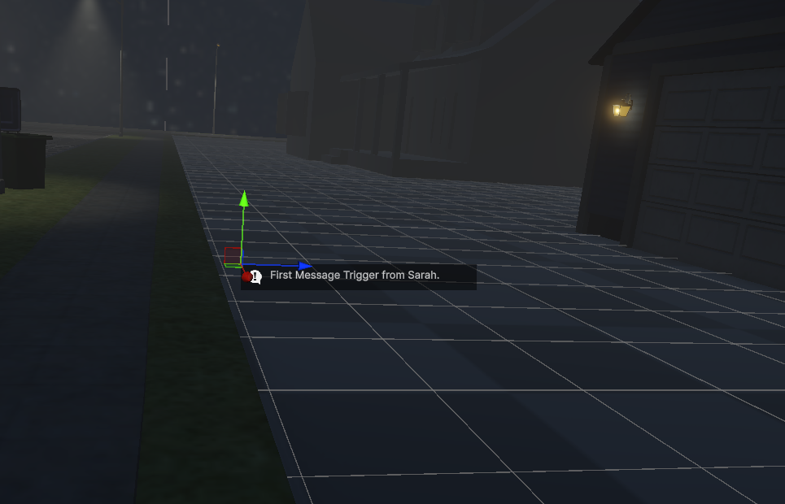
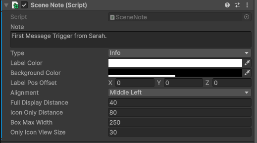
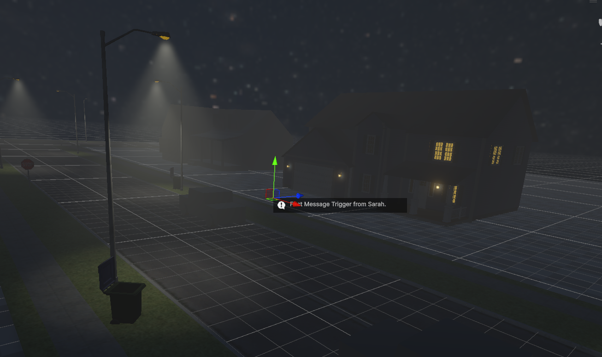

# 🗒️ Scene Note – Unity Editor Utility

> A lightweight and customizable in-editor annotation system for Unity.  
> Perfect for marking key locations, logic notes, or design reminders — all within the scene view.

---

## 🎯 What Is Scene Note?

**Scene Note** is a Unity Editor-only utility that lets you place visual notes directly in your scene. Whether you're planning trigger points, scripting logic, or marking gameplay moments, Scene Note helps teams and solo devs stay organized during development.

---

## ✨ Features

- 💬 Add custom text notes with type-specific icons (Info, Warning, Error)
- 🎨 Fully customizable UI: text color, background, label alignment
- 📏 Adjustable distances for display and icon-only view
- 🧭 Snap note position offsets for clean alignment
- ⚙️ Editor-only: **excluded from build builds automatically**

---

## 🖼️ Preview

### 🔹 Placing Notes in Scene

  

### 🔹 Customization Options in Inspector

  

### 🔹 Visual Result in Scene View

  

---

## 🔍 Ideal Use Cases

- Narrative markers (e.g. “Phone trigger from Sarah”)
- Level design breadcrumbs
- Reminders for VFX, audio, or gameplay logic
- Team communication in shared scenes

---

## 🛠️ Tech Info

- ✅ Works in Unity Editor only (`#if UNITY_EDITOR`)
- ✅ Custom editor + gizmo drawing
- ✅ Lightweight & zero runtime impact
- ✅ Designed for fast scene collaboration

---

## 📦 Tech Stack

`Unity • C# • Custom Editor • Gizmos • Editor-Only Scripts`

---
