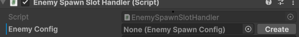
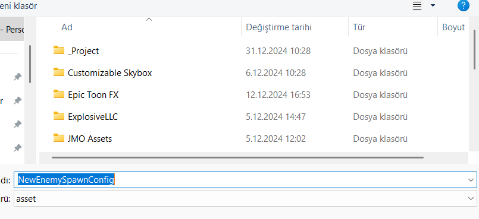
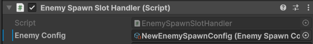

# ⚡ SO Field Assistant – Create & Assign ScriptableObjects Instantly

> A small but powerful Unity Editor tool that improves your workflow with ScriptableObject fields by enabling fast in-place creation.

---

## 🎯 What Is It?

SO Field Assistant enhances Unity's inspector by adding a **"Create" button** next to any `ScriptableObject` reference that is currently unassigned.

No need to leave the inspector, create the asset manually, and then drag it back — just click **Create**, name it, and it’s automatically assigned to the field.

---

## ✨ Features

- 🪄 Adds a **Create button** when a `ScriptableObject` reference is `null`
- 🔄 Instantly creates and assigns the asset to the field
- 📁 Automatically saves the asset to a configurable default path
- 🔍 Works for any custom ScriptableObject field
- 🧼 Clean, minimal inspector override

---

## 🖼️ Preview

### Step 1

  

---

### Step 2

  

---

### Step 3

  

---

## 💡 Use Cases

- Rapid prototyping of enemy stats, item configs, levels, etc.
- Perfect for projects with large amounts of SO-driven data
- Reduces context-switching and clutter during content setup

---

## 🔗 GitHub Repository

You can find the full source code and usage examples here:  
👉 [thekrocker/SO-Field-Assistant](https://github.com/thekrocker/SO-Field-Assistant)

---

## 🛠️ How It Works

Behind the scenes, this tool uses a custom `PropertyDrawer` that detects null SO references and renders a context button next to the property.

On click:
1. Opens a naming popup
2. Creates the asset in the target path
3. Assigns it to the field immediately

> Editor-only; has no runtime impact.

---

## ⚙️ Requirements

- Unity 2021+ (tested on 2022.3 LTS)
- No third-party dependencies

---

## 📦 Tech Stack

`Unity • C# • Custom PropertyDrawer • ScriptableObject • Editor GUI`

---

## 🧠 Why I Built It

Working with data-driven systems in Unity often means handling tons of ScriptableObjects. Manually creating and assigning them breaks flow. This tool exists to fix that — turning a slow, multi-step process into a single click.

---
