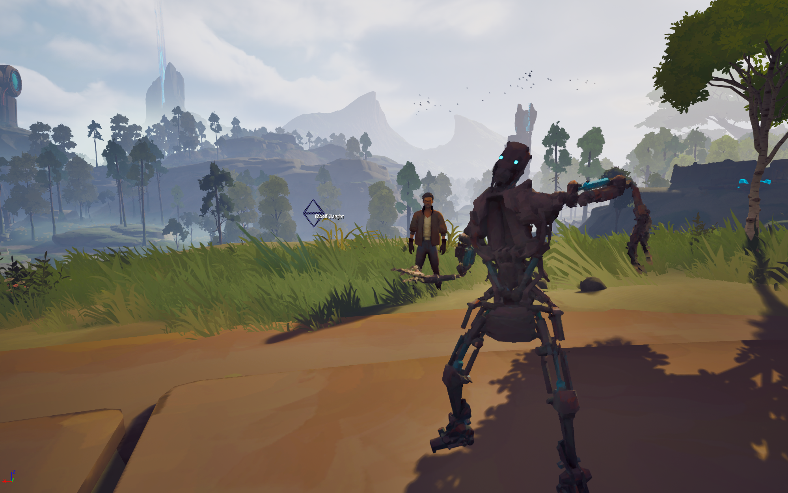
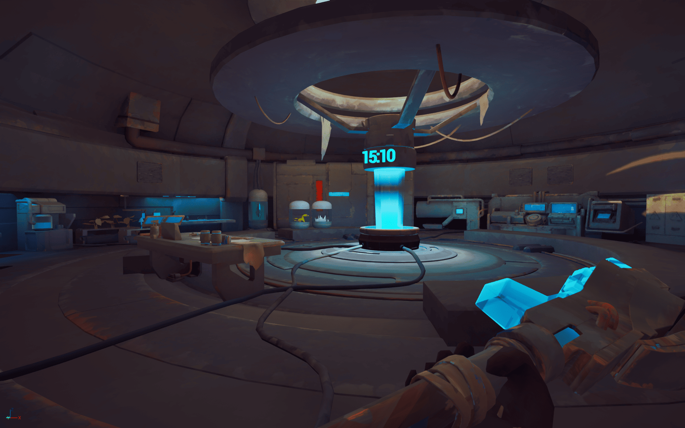
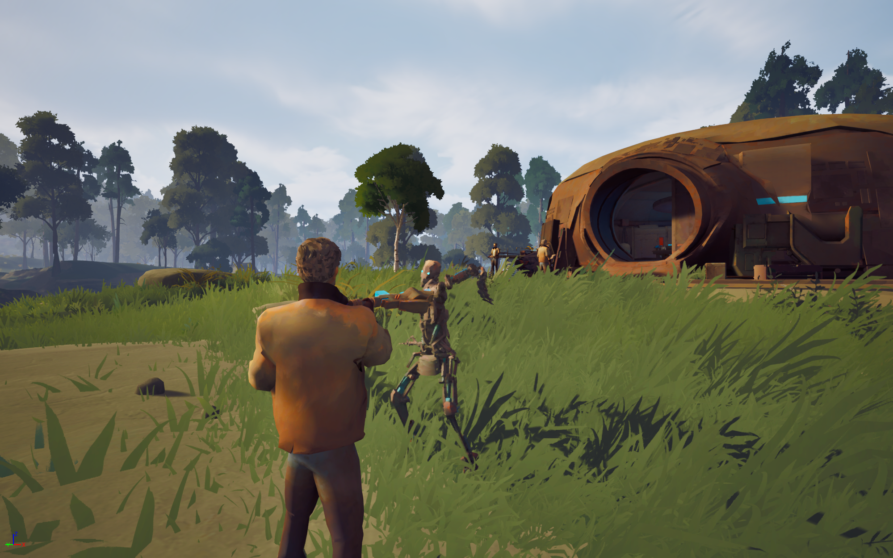
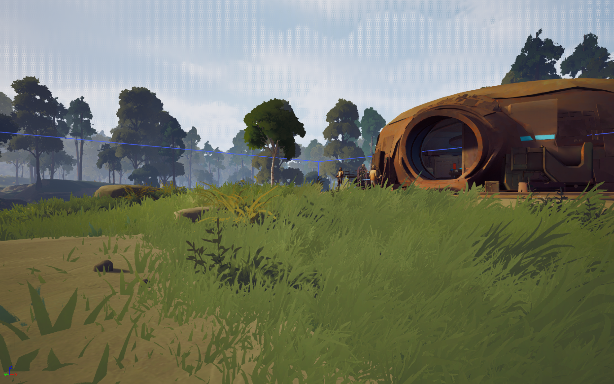
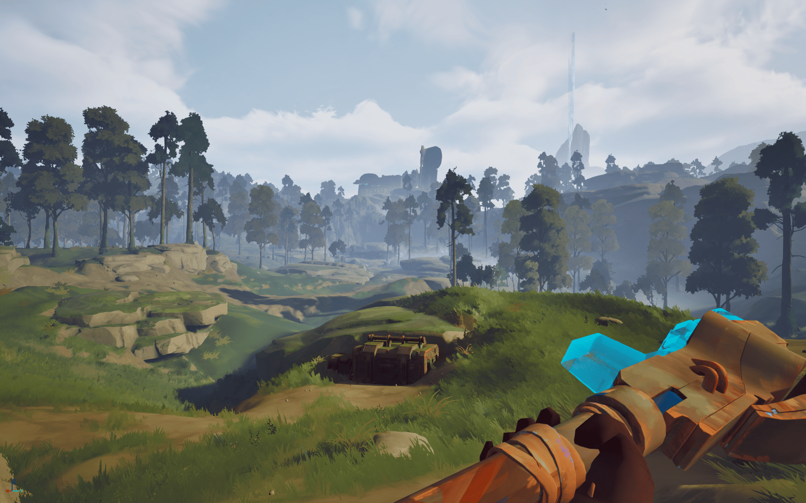
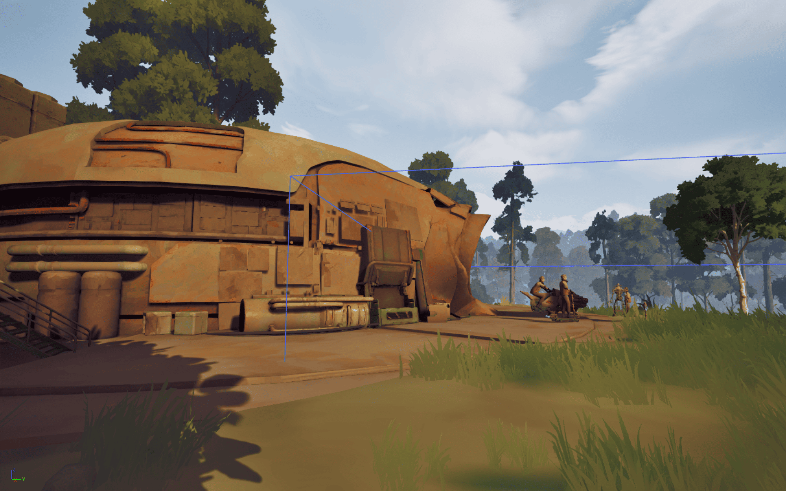
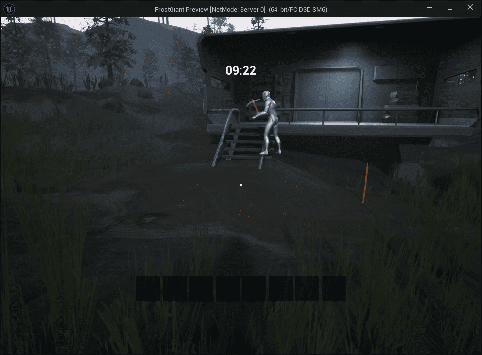

# Survival X – Teleporting Lab Survival

> A solo or co-op survival game set in a post-apocalyptic world, where a malfunctioning lab teleports you into hostile biomes every 15 minutes. Explore, loot, craft, and survive within a shrinking window of safety.

---

## 🗂 Overview

- **Genre**: Survival / Crafting / Exploration  
- **Platform**: PC (Prototype)  
- **Engine**: Unreal Engine 5  
- **Language**: C++ / Blueprints  
- **Inspiration**: *Raft*, *Planet Crafter*, *Valheim*, *Subnautica*, *Don’t Starve Together*

---

## 📸 Media

  
  
  
  
  
  
  

> *Gameplay from survival exploration and lab-based crafting cycle.*  

---

## 🔄 Core Gameplay Loop

- Start inside the **sci-fi lab**, your mobile base and only safe zone  
- Explore the current **randomly teleported biome**  
- Loot, mine, craft, and gather survival resources  
- Return to the **lab’s shield** before the 15-minute countdown ends  
- If outside the shield at teleport: **you lose your inventory**, but still move with the lab  
- Between loops, upgrade the lab, improve survival gear, and unlock new tech

---

## 🌍 Biomes & Hazards

Each biome features distinct environmental threats and unique loot opportunities:

- **Frozen Tundra**: Temperature drops rapidly, risk of frostbite  
- **Radioactive Wasteland**: Radiation exposure without proper suits  
- **Burned Forest**: Rare fuel sources, constant heatwaves  
- **Toxic Jungle**: Dense foliage, poison flora and fauna  
- **Deserted City Ruins**: Loot-rich but unstable terrain  

Biome difficulty scales over time. Crafting the right gear is key to survival in later stages.

---

## 🛠️ Systems I Designed

- **Time-Limited Survival Core**: 15-minute loop system with loss conditions if outside the shield  
- **Shield Boundary Logic**: Detects player presence and triggers inventory drop if out-of-zone  
- **Biome Generator**: Procedural biome transitions every cycle with unique hazards  
- **Crafting System**: Includes gear, survival tools, food, and lab upgrades  
- **Lab Upgrade Tree**: Unlocks new capabilities over time (purifiers, tools, mobility options)  
- **Inventory & Loss System**: Seamless hot/cold inventory separation + penalty design  
- **Hazard Response Design**: Players craft ovens, water filters, radiation gear, etc. to adapt  

---

## 🔧 Key Features

- ✅ High-stakes exploration tied to real-time countdown  
- ✅ Base mobility: The lab teleports every cycle  
- ✅ Procedurally changing environments  
- ✅ Dynamic crafting based on hazard types  
- ✅ Upgradeable base with utility stations and tech progression  
- ✅ Item risk/loss mechanic that encourages smart inventory management  

---

## 🧪 Design Goals

- Create **risk-reward tension** between going further vs. returning to base  
- Encourage **gear-based progression** over grinding  
- Reward exploration and smart preparation  
- Support **co-op or solo** play, with shared lab and individual inventories  
- Make every 15-minute cycle feel meaningful and rewarding  

---

## 🧠 Lessons Learned

- Designing survival systems around a **recurring deadline** creates natural pacing  
- A teleporting base introduces fresh biome challenges while keeping progress centralized  
- Separating permanent and temporary inventory lets us reward risk without punishing players too harshly  
- Hazard-specific gear gives depth and ensures players prepare, not just grind  
- Early upgrades should empower survival, while later ones unlock **biome mastery**

---

## 📦 Tech Stack

`Unreal Engine 5 • C++ • Blueprints • Gameplay Ability System • Modular Inventory • Dynamic Environment Logic • Time-Triggered Events • Crafting System • Save/Load System`
